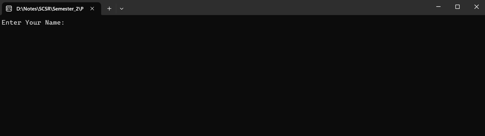
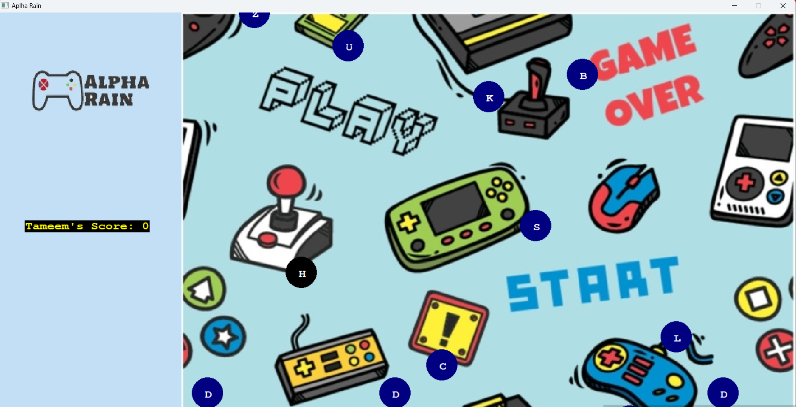
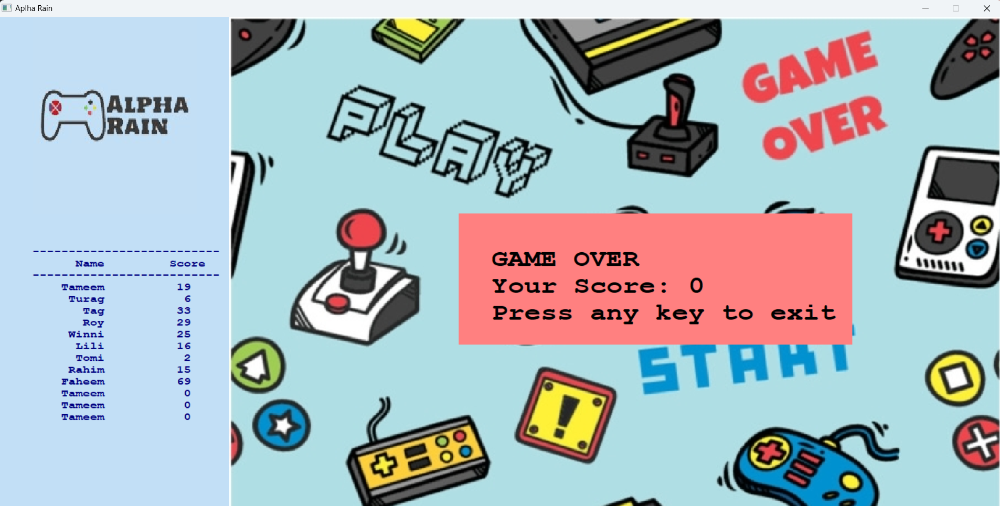

# 2D-Game-C-
In this project, I have created a 2D Typing Master Game using C++ graphics library winbgim.

Step-1:
Add your name to start the game.

Step-2:
Type the letters apearing to your screen to score a point.

Step-3:
At the end, you can compare your socre to previous players.

